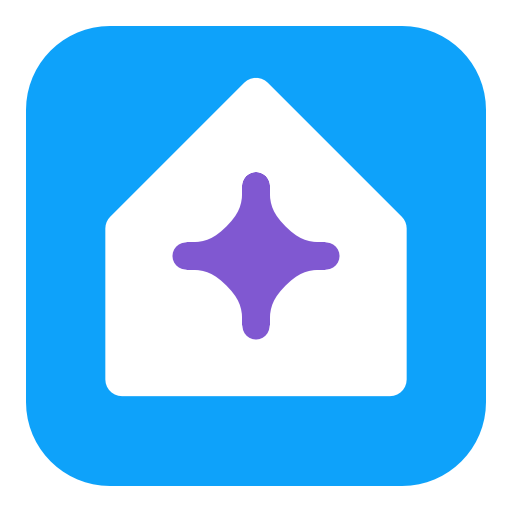

# ha-plus-apps

<picture>
  <source media="(prefers-color-scheme: dark)" srcset="./resources/icons-dark/ha-plus.png">
  
</picture>

Home Assistant Apps

## HA Plus Matter Hub

The Matter Hub app uses the versioned container image published by
[ha-plus-matter-hub](https://github.com/zvikarp/ha-plus-matter-hub). Its manifest and changelog are synchronized from the
latest stable GitHub Release after the matching GHCR image is available.
